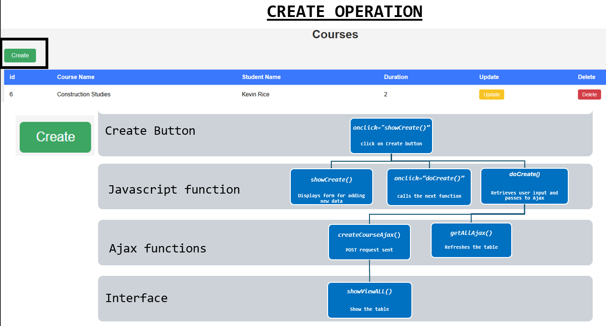

# Web Services and Applications Project Repository

**By Sharon Curley (G00438863@atu.ie)**

    

###### [Image from Scholarship-positions.com](https://scholarship-positions.com/free-online-course-english-for-business-and-entrepreneurship/2018/03/29/)

This repository contains my project submission for the module Web Services and Applications.
My github repository link is as follows:

[SBCURLEY/wsaa-project](https://github.com/SBCURLEY/wsaa-project)
 
 

## Installation
I had to install the below to get started on this project.
- Python : programming language/runtime environment.
- Visual Studio Code : code editor (IDE).
- GitHub : platform.
- WAMP : Windows-based software stack that installs Windows, Apache, MySQL and PHP.
 
 

## Usage
Once the above are installed, you can run the programs.
 
 

## Dependencies
The following libraries are required to execute my programs. Using python, import the following:
- `import json`: JSON is a syntax for storing and exchanging data. It is text, written with JavaScript object notation.
- `import github`: This imports the `Github` class from the `PyGithub` library
- `import dbconfig`: This imports a variable named `dbconfig` from a separate Python file called `dbconfig.py`, and renames it as cfg for use in my script.
- `PyGithub`: library for interacting with GitHub’s API using Python.
- `import mysql.connector` : MySQL client library to connect Python with MySQL databases.
- `import Flask from Flask` : web framework for Python.
- `import CORS` : extension for Flask to handle Cross-Origin Resource Sharing.
 
 

## About
This is a web application for managing courses and enrolled students. It allows users to view, create, update, and delete course records through a dynamic and user-friendly interface. The below image illustrates the flow of data and function calls across my course management application — from the user interface to the database.
 
 

 
 

- Database layer: My SQL data is called 'projcourses'. It has one table called 'course'. This tables has four columns 'id', 'CourseName', 'StudentName',  and 'Duration' of course.

- Data Access Layer : courseDAO.py

- Backend API Layer : server.py

- AJAX Layer : JavaScript/Query

- JavaScript Interface Logic :  ties UI actions to AJAX

- HTML User Interface : visual interface.
 
 

## Repository Structure

### **1. images**

This folder contains all the images used in the README & Project.
 
 

### **2. gitignore**

This gitignore file specifies intentionally untracked files that Git should ignore.
 
 

### **3. courseDAO.py**

This program contains the logic for interacting with the MySQL database. It connects to the MySQL database using credentials from dbconfig.py. It performs SQL operations: SELECT, INSERT, UPDATE, and DELETE. Also, it converts database rows into Python.
 
 

#### References
- Topic 4 Writing a module to interact with API
- Medium - Understanding CRUD Operations: https://medium.com/@sikirus81/understanding-crud-operations-86414348bca4
- Topic WSAA Putting it Together.
 
 

### **4. courseviewer4.html**
This is the main user interface for managing course data. It displays all course rows in a table. 
Below are the main flows for each action a user can choose: Create, Update or Delete. 

#### Create Operation

The user click on green Create button and submits a form with details. The form is sent to the server. The data is refreshed. The updated table is displayed.

#### Update Operation

The user clicks on yellow update button. Update mode is triggered. Form is filled in with current row data. The form is edited with updated details. The form is sent to the server. The data is refreshed. The updated table is displayed.

#### Delete Operation

The user clicks on red delete button. The courses unique id is identified and passed to the Ajax function to begin deletion. The request is sent to the server. The data is refreshed following removal of the deleted course. The updated table is displayed.

 
 

#### References
- Topic 3: HTTPS & URL
- HTTP Made Really Easy:  https://www.jmarshall.com/easy/http/
- w3schools - HTML: https://www.w3schools.com/html/
- w3schools - HTML CSS: https://www.w3schools.com/html/html_css.asp
- Real Python - HTML and CSS: https://realpython.com/html-css-python/   
- w3schools - JavaScript:  https://www.w3schools.com/js/default.asp
- GeeksforGeeks - css tutorial: https://www.geeksforgeeks.org/css-tutorial/
- Topic WSAA Putting it Together.
 
 

### **5. dbconfig.py**
The deconfig.py contains the configuration details needed to connect to the MySQL database using the root user. 
 
 

#### References
- MySQL 5.1 Connecting to MySQL Using Connector/Python:  https://dev.mysql.com/doc/connector-python/en/connector-python-example-connecting.html
- martin-thoma.com - Configuration files in Python: https://martin-thoma.com/configuration-files-in-python/
 
 

### **6. README.md**
This file serves as the first point of contact for users and developers who want to understand the purpose, setup, and usage of my repository.
 
 
 

### **7. requirements.txt**

#### Core Libraries

- Flask==3.0.0 – Web framework.

- flask-cors==5.0.1 – Handles CORS in Flask.

- mysql-connector==2.2.9 – Connects Python to MySQL.

#### Flask Dependencies (Automatically Installed with Flask)

These are indirect dependencies of Flask. You usually don’t need to list them manually unless you want specific versions:

- Werkzeug==3.0.1 – Core library used by Flask for request/response handling.

- Jinja2==3.1.2 – Template engine used by Flask.

- itsdangerous==2.1.2 – Used for secure token generation in Flask.

- click==8.1.7 – Command-line interface library used by Flask.

- blinker==1.7.0 – Optional, used for Flask’s signal support.

- MarkupSafe==2.1.3 – Used by Jinja2 for escaping.

- colorama==0.4.6 – helps with colored CLI output.

#### Python Environment Utilities

- importlib-metadata==6.8.0 – Helps manage metadata in older Python versions.

- zipp==3.17.0 – Supports zip imports; often a transitive dependency of importlib-metadata.
 
 

### **8. server.py**

This program defines the RESTful API endpoints used by the frontend to communicate with the server.
 
 

#### Program Steps

This program uses Flask-CORS to allow cross-origin requests from the frontend. It parses JSON requests and responds with JSON data.
It uses courseDAO for all database operations.
 
 

#### Executable command
- $ python server.py
 

#### References
- Topic 3: RESTful API's
- Topic 6: Flask
- Topic 6: REST server 
- Flask - Application Set up: https://flask.palletsprojects.com/en/latest/tutorial/factory/
- Topic WSAA Putting it Together.
 
 
 
 
Thankyou so much for reviewing my project – it's been a great learning journey!  
Looking forward to your feedback.

– Sharon Curley

